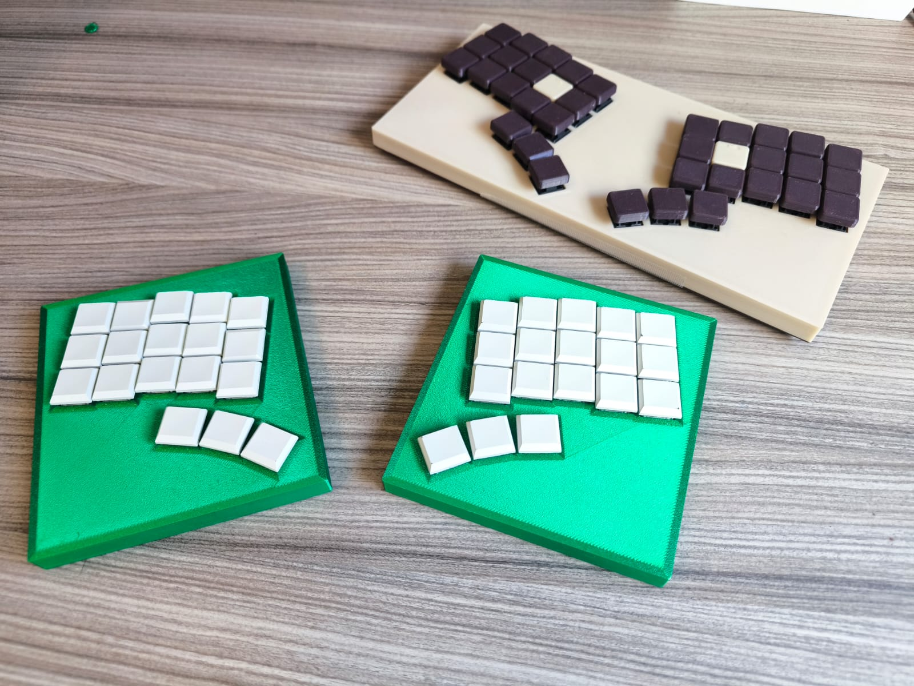
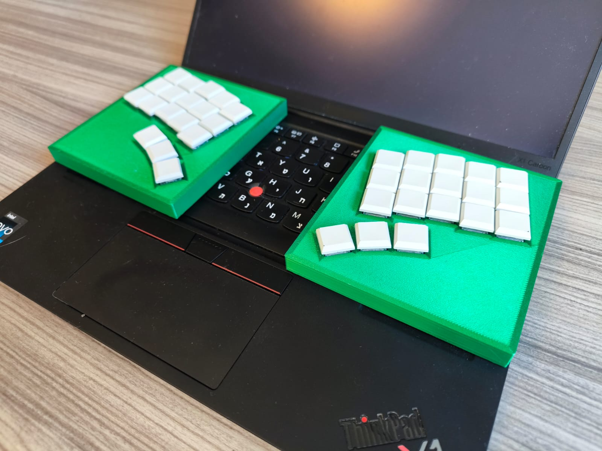
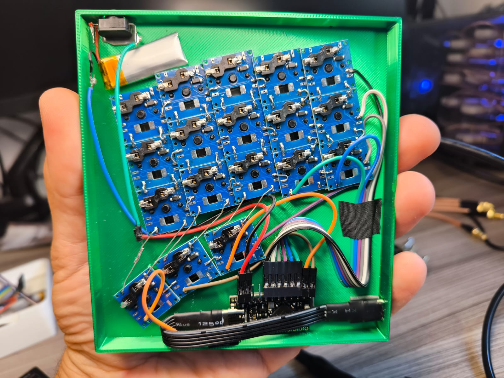
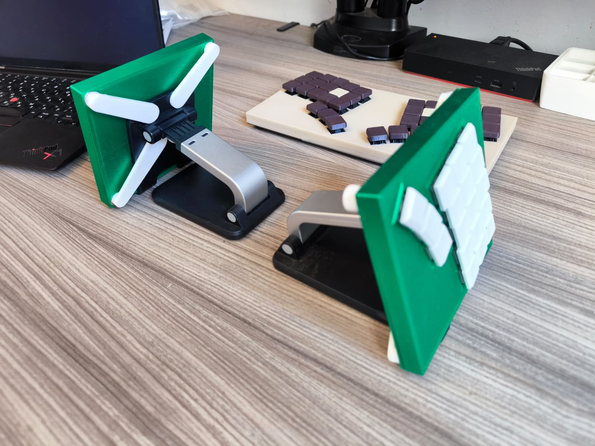

# flatboard

**Generate custom low-profile 3D-printable keyboards without CAD or programming knowledge.**

A parametric keyboard case generator that creates production-ready STL files from simple configuration. Design split keyboards, macropads, full unibody or any custom layout you can imagine—all through TypeScript configuration files.


*Split-36 keyboard next to a unibody-36 variant*


*Ultra-low-profile design sits comfortably on top of a laptop keyboard*

## Why flatboard?

- ⚡ **No CAD software needed** - Define your keyboard with parameters, not 3D modeling
- 🎯 **No programming required** - Just edit configuration values in TypeScript files
- 🖨️ **Direct STL output** - Generate print-ready files without running or even installing OpenSCAD
- 🔧 **Fully parametric and Infinitely customizable** - Every dimension calculated from your configuration: Layouts, switches, connectors, sizes—everything is configurable


*Internal components: hand-wired matrix with electronics bay*


*Magnetic mounting system using phone holder for adjustable tenting*

## What You Can Configure

### Switch Types

Built-in support for popular mechanical switches:
- **Kailh Choc** - Low-profile switches
- **Cherry MX** - Standard mechanical switches

**Add custom switch types** by defining specifications in `src/switches.ts`:
```typescript
mySwitch: {
  description: 'My Custom Switch',
  switch: {
    cutout: { height: 1.5, inner: 13.8, outer: 15.0 },
    plate: { thickness: 1.6, totalThickness: 8.0 }
  },
  layout: { matrix: { spacing: 19.0 } }
}
```

### Connectors

Built-in connector types:
- **USB-C** - Pill-shaped female socket
- **TRRS** - 3.5mm audio jack (for split keyboards)
- **Power Button** - Generic circular button

**Create custom connectors** with any shape:
- `circle` - Simple circular cutout (specify radius)
- `pill` - Rounded rectangle (specify circle radius + distance)
- `square` - Rectangular cutout (coming soon)

Connectors can be placed on any face (top, bottom, left, right) with precise positioning (0-1 along edge).

Example custom connector:
```typescript
myConnector: {
  description: 'My Custom Port',
  geometry: {
    type: 'circle',
    radius: 4.0
  }
}
```

### Layout System

**Fully flexible row-based layouts** with per-row control:

```typescript
rowLayout: [
  { start: 0, length: 6, offset: 0 },    // 6 keys starting at column 0
  { start: -1, length: 6, offset: 2 },   // 6 keys starting at column -1, 2mm stagger
  { start: 0, length: 5, offset: 5 },    // 5 keys starting at column 0, 5mm stagger
]
```

- **`start`** - Starting column position (can be negative for left offset)
- **`length`** - Number of keys in the row
- **`offset`** - Column stagger in millimeters


**Optional Thumb clusters** with independent control:
- Number of keys
- Spacing between keys
- Rotation angle
- Offset position
- Per-key rotation and offsets

**Split keyboard support** with automatic mirroring for left/right halves.

### Enclosure
Snap-fit rounded corners enclosure with no need for screws.
Full control over case dimensions:
- Plate thickness (top and bottom and walls)
- Edge margins: extra spacing around the keys
- Electronics cavity depth
- Rubber feet / Magnets socket positions and custom size.

## Installation

```bash
git clone git@github.com:20lives/flatboard.git
cd flatboard
bun install
```

## Quick Start

### 1. List available keyboards

```bash
bun run list
```

Output:
```
Available keyboard profiles:
  • macropad-3x3: 9 keys {0:3,0:3,0:3} [choc]
  • split-36: 18 keys {0:3,0:3,0:3,0:3,0:3} + 3 thumbs [choc]
  • test-single-choc: 1 keys {0:1} [choc]
```

### 2. Build a keyboard

```bash
bun run build -- split-36
```

Output:
```
Generated files for profile: split-36
  • Keyboard size: 18 keys
  • Plate dimensions: 123.5×114.2mm

./dist/split-36-w92ivk/
├── bottom.scad (7.9K)
├── complete.scad (50.7K)
└── top.scad (38.2K)
```

### 3. Generate STL files (3D printing ready)

```bash
bun run build:stl -- split-36
```

Output:
```
./dist/split-36-w92ivk/
├── bottom.scad (7.9K)
├── bottom.stl (52.8K)    ← Ready to print!
├── complete.scad (5.9K)
├── complete.stl (49.6K)
├── top.scad (3.5K)
└── top.stl (50.5K)        ← Ready to print!
```

## Build Modes

### Production Build
```bash
bun run build -- <profile>
```
- Outputs to `dist/<profile>-<hash>/`
- Generates SCAD files only
- Each build preserved with unique timestamp
- Fast iteration for design changes

### STL Build
```bash
bun run build:stl -- <profile>
```
- Outputs to `dist/<profile>-<hash>/`
- Generates both SCAD and STL files
- Uses OpenSCAD renderer internally
- Ready for 3D printing

### Development Mode
```bash
bun run build:dev -- <profile>
```
- Outputs to `dist/` (overwrites)
- Watch mode: rebuilds on file changes
- Open `dist/top.scad` / `dist/bottom.scad` / `dist/complete.scad` in OpenSCAD for live preview
- Perfect for rapid iteration

## Creating Your Own Keyboard

### Step 1: Create a profile file

Create `profiles/my-keyboard.ts`:

```typescript
import type { ParameterProfile } from '../src/interfaces.js';

export const profile: ParameterProfile = {
  layout: {
    matrix: {
      rowLayout: [
        { start: 0, length: 5, offset: 0 },
        { start: 0, length: 5, offset: 2 },
        { start: 0, length: 4, offset: 5 },
      ],
    },
    edgeMargin: 8.0,      // Space around keys
    baseDegrees: 10.0,    // Overall rotation
  },

  switch: {
    type: 'choc',         // or 'mx'
  },

  thumb: {
    cluster: {
      keys: 3,            // Number of thumb keys
      spacing: 20.0,      // Space between thumb keys
      rotation: 15.0,     // Thumb cluster angle
    },
    offset: {
      x: 25,              // Horizontal position
      y: 2,               // Vertical position
    },
  },

  connectors: [
    {
      type: 'usbC',
      face: 'top',        // top, bottom, left, or right
      position: 0.5,      // 0-1 along the edge
      enabled: true,
      clearance: 0.2,
    },
  ],

  enclosure: {
    plate: {
      topThickness: 1.5,
      bottomThickness: 1.5,
    },
    walls: {
      thickness: 1.5,
      height: 9.0,
    },
  },
};
```

### Step 2: Build it

```bash
bun run build:dev -- my-keyboard
```

## Advanced Customization

### Per-key Thumb Rotation

```typescript
thumb: {
  cluster: {
    keys: 3,
    spacing: 20.0,
    rotation: 15.0,
  },
  perKey: {
    rotations: [-10, 0, 10],    // Individual key angles
    offsets: [
      { x: 2, y: 0 },            // Fine-tune each key position
      { x: 0, y: 0 },
      { x: 2, y: 0 },
    ],
  },
}
```

### Rubber Feet Sockets

Add reinforced sockets for silicon rubber feet:

```typescript
enclosure: {
  bottomPadsSockets: [
    {
      shape: 'round',              // or 'square'
      size: { radius: 5.05 },
      depth: 1.1,
      position: {
        anchor: 'bottom-left',     // corner anchor
        offset: { x: 0, y: 0 }     // fine adjustment
      },
      reinforcement: {
        thickness: 1,
        height: 0.2
      },
    },
  ],
}
```

### Magnetic Mounting

Add MagSafe ring socket for tenting with phone holders and magnetic mounts:

**Standard MagSafe dimensions:**
- Outer diameter: 55mm
- Inner diameter: 50mm
- Depth: 0.5mm

```typescript
enclosure: {
  magsafeRing: {
    clearance: 0.2,              // Fit adjustment (positive = looser)
    reinforcement: {
      outer: 2.0,                // Thickness around outer diameter
      inner: 2.0,                // Grip margin on inner diameter
      height: 0.5,               // Additional height for ring
    },
    position: {
      offset: { x: 0, y: 0 },    // Offset from keyboard center
    },
  },
}
```

### Multiple Connectors

```typescript
connectors: [
  {
    type: 'usbC',
    face: 'left',
    position: 0.8,
    enabled: true,
    clearance: 0.2,
  },
  {
    type: 'trrs',
    face: 'right',
    position: 0.3,
    enabled: true,
    clearance: 0.2,
  },
  {
    type: 'powerButton',
    face: 'top',
    position: 0.1,
    enabled: true,
    clearance: 0.2,
  },
]
```

## Included Profiles

- **split-36** - 36-key split ergonomic keyboard (15 + 3 thumb per hand)
- **macropad-3x3** - 9-key macropad (3×3 grid)
- **test-single-choc** - Single key test configuration


## Design & Print Tips

### Before Your First Build

**Start with a test print:**
Print the `test-single-choc` / `test-single-mx` profile first to Verify your printer is properly tuned and check that switches fit snugly in the top plate.
Test the snap-fit mechanism between top and bottom parts Ensure parts snap together securely without excessive force, use a plastic pry tool to reopen the case without damage.

### Planning Your Layout

**Electronics space:**
- Leave adequate room for your microcontroller and battery (if used)
- Consider the thickness of your wiring and components
- Default cavity depth may need adjustment based on your electronics

**Adjust dimensions if needed:**
- Modify `walls.height` for more internal space
- Add `layout.edgeMargin` to create more space around switches
- This gives you extra room for routing wires and fitting components

**Connector placement:**
- Double-check connector positions don't interfere with:
  - Switch positions
  - Internal electronics
  - Other wires routing paths
- Use `build:dev` mode with OpenSCAD preview to verify clearances

### Printing

**Material:** whatever you want, probably PETG will be better choice for durability.
**Supports:** The top part will need support for the switchs and the bottom part might need if you used rubber feet sockets.
**Orientation:** the top part might be needed to be rotated 180 degrees.

### Assembly

All electronics and wiring fit in the top part of the case.

### File outputs
- `top.scad` / `top.stl` - Top plate with switch mounting and electronics cavity.
- `bottom.scad` / `bottom.stl` - Bottom case with 
- `complete.scad` / `complete.stl` - Assembled keyboard for preview

## Technical Stack
- **TypeScript** - Configuration and logic
- **scad-js** - OpenSCAD code generation
- **fp-ts** - Functional programming patterns
- **Bun** - Fast runtime and build system

## Commands Reference

```bash
bun run build -- <profile>      # Generate SCAD files
bun run build:dev -- <profile>  # Watch mode (live preview)
bun run build:stl -- <profile>  # Generate STL files (3D printing)
bun run list                    # List all keyboards
bun run help                    # Show help
bun run clean                   # Remove generated files
```

## Planned Features

Upcoming enhancements planned for future releases:

- **Web UI** - Browser-based visual configurator for designing keyboards without editing code
- **Multi-row thumb clusters** - Support for complex thumb layouts with multiple rows
- ~~**Patterned bottom** - Honeycomb or lattice patterns for weight reduction and material optimization~~
- **Non-rectangular enclosures** - Organic and curved case shapes beyond rectangular boxes
- **Trackpad/trackpoint support** - Integrated pointing device mounting and cutouts
- **screws standoffs** - instead of snap-fit.

Have a feature request? Open an issue on GitHub!

## Contributing

Add your keyboard profiles! Create a `.ts` file in `profiles/` and submit a PR.

For custom switch types or connectors, add them to `src/switches.ts` or `src/connector-specs.ts`.
